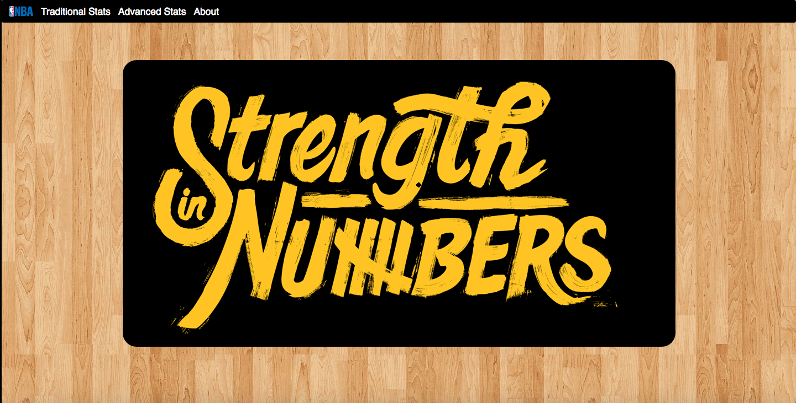

#Strength in Numbers

[Heroku: Strength in Numbers - application](https://strength-in-numbers.herokuapp.com/)

##Overview:
A web application built with MongoDB, Express.js, Angular.js, Node.js, D3.js, and Angular-nvD3.js that helps you settle bar fights over who the best NBA player is with visualized stats!

#### Features:
##### Visual Comparison of Stats with Chart:
- Select 2 NBA players and compare their stats in a chart.

##### View Basic info of :
- See basic info on 2 NBA players.

#### Planning:

Plan: 

ERD: 

#### Issues:

**D3/Angular:**
We ran into an issue getting angular and d3 to use the same set of data to render the charts and dropdowns.  We installed the angular-nvd3 library to allow us to use a custom directive.  With nvd3 in place, we could write the d3 code in the angular controller to render the chart.

**Deploying to Heroku:**
Heroku was not able to install all our bower components, specifically the d3 and angular-nvd3 libraries.  We had to replace the script paths in our index page with URLs to their respective CDNs.

#### Technologies Used:
- HTML5, CSS3, JavaScript, MongoDB, Express.js, Angular.js, Node.js, D3.js, Angular-nvD3.js, Bootstrap, Heroku, mLaB

- Design: Wireframe(balsamiq), Draw.io

- Text Editor: Sublime 3

- Project Management: Trello

#### Project Links:

[MVP Wireframe](https://trello.com/c/N18k61Fz/18-new-mockup-1-png)

[Trello: User Stories](https://trello.com/b/CSUpD9Vh/strength-in-numbers-dev)

[GitHub: Strength in Numbers - repository](https://github.com/daquigley4/strengthinnumbers)

[Heroku: Strength in Numbers - application](https://strength-in-numbers.herokuapp.com/)

### Future Features:
- Integrate an api to display up-to-date stats of all NBA players

- Ability to sort stats from different seasons or playoffs

- More advanced chart comparisons